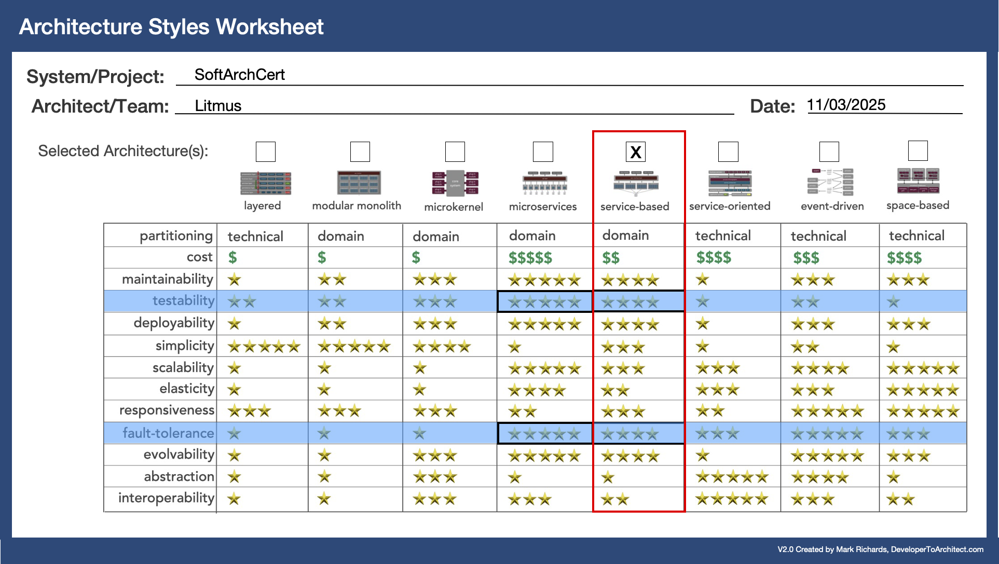

# Architecture Decision Record (ADR)

## ADR-02: Architecture style

### Status:

ACCEPTED

### Context:

The choice of architectural style is crucial to the success of a software project, as the key driving characteristics are used to shape the architectural decisions made throughout the design process. 

Though the identification of architecture characteristics is one of the first steps in the architecture design process, it can evolve in an iterative process throughout the design phase where the driving architectural characteristics will influence the design of the system, and as the system design takes shape and aims to reflect the driving architectural characteristics, learnings and decisions made throughout the process can in turn influence the driving architectural characteristics.

It's important to select a style that fits the problem domain, as changing it during implementation can be costly. Consistent implementation of the architecture also enhances the system’s clarity and understanding.

Depending on the style, additional decisions like databases, communication patterns, ... can be derived.

### Decision:

We started out focusing on Cost and Scalability, which led us to do analysis of LLM costing models and grading SLAs. We learnt that the cost of the solution would be nowhere near as expensive as the cost of the expert architects, and scaling is less of a concern when you have long SLAs and not huge volumes of processing.

That led us to focus on the critical concerns of the business namely:

> **Critical Information**
> * As a recognized leader in certification, accuracy of tests, case studies, and grading is job and. Inaccurate grading can result in a candidate not getting or maintaining a job and can impact a candidate's career.
> * Inaccurate or misleading certification exams and case studies can undermine the credibility of the company’s current standing in the marketplace, so accuracy of the certification process is vital for the success of the company.

According to the requirements and the [Architecture Characteristics](../Architecture%20Characteristics/architecture-characteristics.md) we decided to use the service-based Architecture to better support testability, data integrity, and fault tolerance.

This compliments the existing architecture as it too follows an service-based architecture style. This allows us to integrate our additional components into existing components and databases thereby reducing complexity, and taking advantage of the existing driving architectures of the current system.

### Consequences:

- Service-based architecture style is comparatively cheaper and faster to build and easier to maintain.
- Additional components can integrate with existing components and databases.
- The option remains to evolve the architecture through decomposition of existing components based on need derived from observing system behaviour and meeting future needs.

### Strengthened characteristics:
- Cost (relatively straight forward to implement).
- Maintainability (easy to add new services/models with new functionality).
- Testability (independent services with clear interfaces).
- Fault tolerance (independent services can remain functional during partial failure)

### Weakened characteristics
- Elasticity (due to shared databases between services).

### Date
02/13/2025
