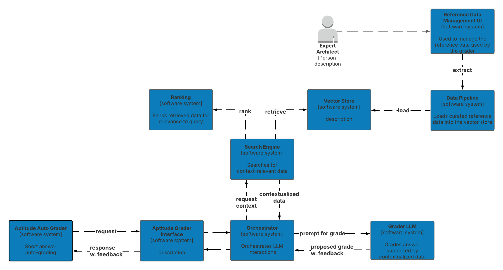

# Architecture Decision Record (ADR)

## ADR 03: Aptitude Test Grader

### Status

- ACCEPTED

### Context

The current process of grading short answer submissions for examinations is manually handled by an expert architect, which is time-consuming and resource-intensive. Automating this process using AI can increase efficiency, reduce response time to the candidate and allow the company to reduce overall costs.

### Decision

The decision is to implement an AI-based grading system using a small Large Language Model (LLM) supported by a Retrieval-Augmented Generation (RAG) pattern. This solution will leverage tailored reference materials curated by the Expert Architects, enhancing the accuracy and reliability of the grading process. We will include guardrails to ensure the grading is accurate and does not degrade over time. Such guardrails should include  setting confidence thresholds, defining criteria that must be followed when evaluating submissions and ensuring the training data is accurate, representative and up to date. Regular audits will be required to maintain quality.

### Alternatives Considered

#### **1. Using a small LLM supported by RAG pattern**

*Description*:

A smaller LLM gives opportunity to provide a lower cost entry into AI generated grading, while we can increase the accuracy by leveraging curated reference materials via a RAG pattern. These curated materials may include excerpts of work from industry leaders or case-studies relevant to the particular questions being answered. Suitable attribution of source materials should be provided along with exam feedback.

*Pros*:
- Efficiency: Significantly reduces the time required to grade submissions
- Resource Allocation: Frees up expert resources for more strategic activities
- Scalability: Capable of handling large volumes of submissions simultaneously
- Cost-effectiveness: Smaller LLMs are generally more economical compared to larger models

*Cons*:
- Complexity: Increases architectural complexity with the integration of RAG.
- Initial Setup and Maintenance: Requires effort to configure and maintain retrieval mechanisms.

#### **2. Training a Custom ML Model on Historical Dataset**

*Description*:

With a large historical dataset available, we could train a custom ML model to identify correct answers and reject incorrect ones. However, new questions would not have this historical context and would present additional training challenges.

*Pros*:
- Tailored Solution: Custom model specifically trained for the grading task using historical data.
- Control: Full control over the model training process and updates.
- Availability of training data: We have a large historical dataset available to train the model.

*Cons*:
- Resource Intensive: Requires significant data science expertise and resources for development and maintenance.
- Time-Consuming: Model training and frequent retraining needed to accommodate new data.
- Generalization: Risk of poor performance on new or varied questions without regular updates.
- Degrading Data Quality: There is a risk that the quality of the dataset erodes over time and degrade the integrity of the tests.

#### **3. Using a Large LLM for Grading**

*Description*:

A large general purpose LLM could be leveraged to bring the full power of a GenAI model to understanding and grading the candidates responses to questions. This offers the simplest entry-point to AI generated grading.

*Pros*:
- Advanced Capabilities: Leverages pre-trained language understanding for handling complex grading tasks.
- Simplicity: Reduced need for extensive custom model training.

*Cons*:
- Cost: High operational costs due to computational demands of large models.
- Overfitting Risk: May require fine-tuning to avoid misinterpretation of grading contexts.
- Dependency: Relies on external service providers, which may not align with internal privacy and update needs.
  
#### **4. Using an Ensemble Approach with Specialized Models**

*Description*:

Multiple GenAI personas can be developed to each adopt a specific role when it comes to grading a candidates answer, each advocating for it's own criteria of a correct answer. The models would interact to produce an aggregated grade that is fully reflective of all aspects of the grading criteria.

*Pros*:
- Specialized Insights: Different models can focus on distinct aspects of the grading, such as content accuracy, language use, and logical coherence, potentially providing a more nuanced evaluation.
- Collaborative Grading: By aggregating impressions from multiple models, the system can arrive at a consensus grade, potentially improving grading reliability and fairness.
- Adaptability: Models can be independently updated or replaced as grading criteria evolve or new requirements emerge.
- Embedded Specialized Feedback: One persona can be developed to specifically focus on providing high quality feedback for the candidate as a result of the models' interaction.

*Cons*:
- Complex Coordination: Requires sophisticated algorithms to integrate and reconcile diverse model outputs into a single grade.
- Resource Demand: Running multiple models simultaneously can increase computational requirements.
- Integration Complexity: More complex architecture needed to manage and coordinate the outputs of various models effectively.

### References
- [ADR-09: Approach for RAG implementation](./ADR-09-Approach-for-RAG-implementation.md)
- [ADR-11: Feedback from AI generated grading](./ADR-11-Feedback-from-AI-generated-grading.md)

- ### Date
02/13/2025
