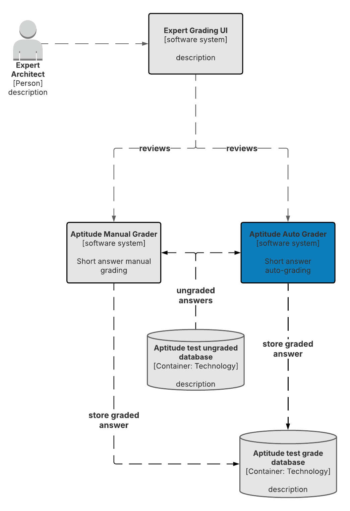

# Architecture Decision Record (ADR)

## ADR 04: Handling Low Confidence Scores in AI-Enhanced Grading using Guardrails
 
### Status
- ACCEPTED

### Context
As we integrate Generative AI into the certification process for grading exams and submissions, it is vital to establish 
a strategy for managing low confidence scores produced by the AI models, including guardrails where appropriate.
Low confidence scores may indicate uncertainty in evaluations and could lead to incorrect grading outcomes, impacting 
candidates’ careers and the credibility of the SoftArchCert certification.

### Decision
To address low confidence scores in the AI-enhanced grading system, we will implement the following measures:

- Thresholding for Confidence Scores:
Set a minimum confidence threshold (initially proposed at 0.7) for automated grading decisions. Submissions scoring below
this threshold will be flagged for human review by expert software architects.

- Queue System:
Introduce a message queue (e.g. AWS SQS) to hold submissions flagged for manual review. This component will ensure 
that submissions are processed in a reliable and orderly manner, allowing the system to efficiently manage increased loads.

- Manual Review Component:
Develop a dedicated service that manages the manual review workflow. This component will:
  - Auto-assign flagged submissions to available expert reviewers based on their expertise and current workload.
  - Track the status of each submission throughout the review process.
  - Provide a user interface for reviewers to submit their evaluations and feedback.

- Expert/Reviewer Notification System:
Implement a notification mechanism that alerts expert reviewers when submissions are queued for their attention. This 
will enable timely reviews and improve response times, thereby enhancing the overall efficiency of the grading process.

- Human-in-the-Loop Review Process:  
Develop a process where expert architects review submissions with low confidence scores. This dual-validation system 
ensures fairness and accuracy, with architects able to utilize AI-generated feedback during their assessments.

- Confidence Score Feedback Loop:
Establish a mechanism for collecting feedback from expert architects on low-confidence submissions. Inaccurate assessments
identified during review will be used to improve the AI model through retraining.

- Monitoring and Alerts:
Implement monitoring tools to track the frequency of low confidence scores. Alerts will be triggered if a specified 
percentage of submissions fall below the confidence threshold, allowing for prompt investigation of model performance.

- Transparency and Communication:
Clearly communicate the role of AI in the grading process to candidates, including the potential for human review. Provide
detailed feedback when manual reviews occur, ensuring candidates understand the rationale behind their scores.

### Alternatives Considered
- **Option 1:** Complete Automation of Grading:
Initially, we considered fully automating the grading process without human intervention. However, this posed significant
risks to the accuracy and fairness of assessments, particularly for nuanced submissions.

- **Option 2:** Higher Confidence Threshold:
A higher initial confidence threshold was discussed (e.g., 0.8 or above). However, this could lead to excessive manual 
reviews, potentially delaying grading turnaround times and overwhelming the expert review team.

- **Option 3:** No Intervention for Low Confidence Scores:
The option to proceed without additional review for low confidence scores was also considered. This approach could 
undermine the integrity of the certification process and erode trust among candidates.

### References
[Ensuring Accuracy in AI with Human-in-the-Loop](https://medium.com/@j.m.olivera08/ensuring-accuracy-in-ai-with-human-in-the-loop-7a4d9143296d)

### Date
02/13/2025
