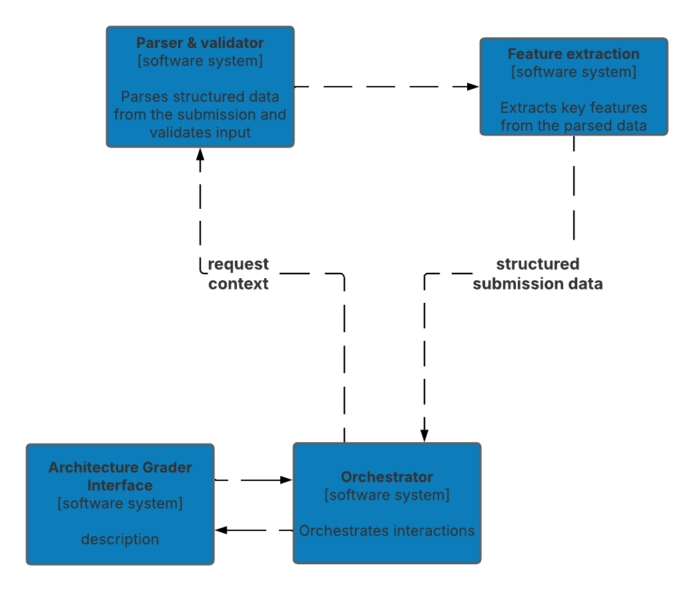

# Architecture Decision Record (ADR)

## ADR 05: Structured Formatting of Exam Inputs

### Status
- ACCEPTED

### Context
As part of the initiative to introduce AI capabilities to the exam grading process, we need to consider any structured formatting needs for supplementary materials (e.g., C4 diagrams) that 
candidates will need to input into the exam system. Any proposed structure should facilitate automated grading, ensure consistency, and enable analytics for further improvement of exam processes. 
The adoption of PlantUML as a structured formatting tool for exam inputs establishes robust guardrails and facilitates meaningful evaluations. By ensuring consistency, accuracy, and quality in 
submissions, Certifiable, Inc. can enhance the effectiveness of its AI-enhanced grading system and maintain high standards of certification for candidates. Regular assessments and feedback mechanisms 
will also contribute to continuous improvement in both the grading process and candidate experience.

### Decision
After evaluating the options, we recommend using Option 1: PlantUML as a structuring tool for supplementary materials e.g. diagrams. Although AI image processing presents an innovative approach, 
the potential inaccuracies and resource requirements make it less favorable given our current needs and capabilities.

### Alternatives Considered
- **Option 1:** PlantUML    
  **Description**: PlantUML is a text-based tool that allows users to create UML diagrams from a simple and intuitive markup language. 
  Diagrams are generated from the textual descriptions provided in PlantUML code.  
  **Pros**:     
  The markup language is relatively simple to learn, enabling users to create and modify diagrams quickly and PlantUML can be easily integrated into various IDEs, 
  CI/CD pipelines, and documentation tools. PlantUML ensures consistency in style and layout across diagrams, as they are generated from the same underlying code.     
  **Cons**:          
  Although relatively easy, there is still a learning curve for users unfamiliar with markup languages. Additionally, users may not see the diagram until it is generated, 
  which can slow down the design process and advanced customizations may require in-depth knowledge of PlantUML syntax and features.

- **Option 2:** AI Image Processing     
  **Description**: Utilize an AI model capable of analyzing images of diagrams, extracting the key elements, and providing textual descriptions of those diagrams.  
  **Pros**:     
  Users can create diagrams visually and simply take a photo or screenshot for processing, which may be more intuitive for some individuals.    
  **Cons**:     
  The effectiveness of the AI model can vary depending on image quality and the complexity of the diagrams, and misinterpretations may lead to inaccuracies in the generated descriptions.
  Additionally, developing, training, and maintaining an AI model requires significant technical expertise and computational resources (at significant cost).

### References
[PlantUML](https://plantuml.com/)   
[AI Image Processing: Everything you Need to Know](https://medium.com/@klear-stack/ai-image-processing-everything-you-need-to-know-4cd337e0149a)

### Date
02/13/2025
