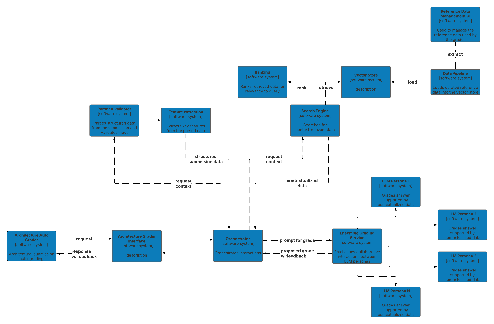

# Architecture Decision Record (ADR)

## ADR 06: Architectural Submission Grader

### Status

- ACCEPTED

### Context

The current grading system for architectural submissions requires an automated solution that can handle complex assessments while providing detailed feedback. A single AI model may struggle to capture all the nuances of a submission across multiple criteria. Therefore, an approach that leverages specialized AI capabilities is desirable. Additionally, cost efficiency remains a key concern, necessitating a solution that optimizes resource usage.

### Decision

The decision is to implement a [Retrieval-Augmented Generation (RAG)](./ADR-09-Approach-for-RAG-implementation.md) based ensemble system. This involves using multiple AI personas, each tasked with grading a specific aspect of the submission. The system will parse submissions to extract key features, tailoring the context for each LLM to reduce costs. By designing the system to leverage feedback from both the AI personas and human reviewers, the architecture builds in a mechanism for continuous improvement. This ensures that the system evolves based on real-world performance and feedback, thereby enhancing the overall quality of grading.

### Alternatives Considered

#### 1. RAG-Based Ensemble System with Specialized AI Personas

*Description*:

This approach utilizes multiple AI personas, each powered by a Large Language Model (LLM) to grade distinct aspects of the architectural submission, such as design, functionality, and compliance with standards. The system uses a RAG framework to provide relevant information to each persona. By parsing the submission to extract key features, the context for each LLM is narrowed, thus optimizing performance and controlling costs. The RAG system will use curated materials, including excerpts of work from industry leaders or case-studies relevant to the particular questions being answered. Suitable attribution of source materials should be provided along with exam feedback.

*Pros*:
- Specialization: Allows each LLM to focus on a specific grading aspect, improving accuracy and depth of feedback and provides a guardrail against generalisation errors that nmight occur in a single model. The specialized nature of each AI persona allows for targeted evaluations of grading accuracy in different aspects of submissions. Metrics such as precision, recall, and F1 score can be employed to assess how well each persona performs relative to human assessments and across grading dimensions.
- The system can include performance metrics that track the computational efficiency of each AI persona. Monitoring operational costs alongside grading speed will help ensure that the system remains cost-effective while delivering timely feedback to candidates.
- Cost Efficiency: By narrowing context, the system reduces the computational load and associated costs for each grading task acting as a financial guardrail.

*Cons*:
- Complex System Integration: Requires sophisticated architecture to manage multiple AI personas and integrate their outputs.
- Coordination Overhead: Needs careful coordination to ensure consistent and coherent final grading outcomes.

#### 2. Single Comprehensive LLM

*Description*:

A single, large LLM would be employed to handle all grading tasks, leveraging its extensive pre-trained capabilities to assess various aspects of the submission.

*Pros*:
- Simplicity: Easier to manage a single model as opposed to coordinating multiple personas.
- Unified Approach: Ensures consistency in grading style and feedback delivery.

*Cons*:
- Cost: Higher operational costs due to the need for a powerful, comprehensive model.
- Performance Limitations: A single model may struggle to capture nuanced details across different grading criteria.

#### 3. Traditional Rule-Based System

*Description*:

A rule-based system would be used, incorporating predefined criteria and guidelines to automate grading.

*Pros*:
- Predictability: Offers predictable outcomes based on predefined rules and logic.
- Lower Development Costs: Initial setup might be simpler than training and deploying multiple LLMs.

*Cons*:
- Inflexibility: Lacks adaptability and may not effectively handle complex or creative submissions.
- Maintenance: Requires continuous updates to keep rules current with evolving standards and criteria.

### References
- [ADR-09: Approach for RAG implementation](./ADR-09-Approach-for-RAG-implementation.md)
- [ADR-11: Feedback from AI generated grading](./ADR-11-Feedback-from-AI-generated-grading.md)

### Date
[Date of the decision]
