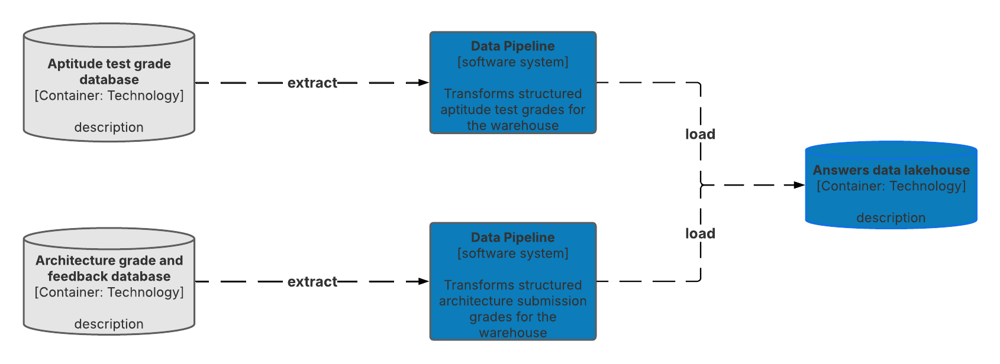

# Architecture Decision Record (ADR)

## ADR 08: Data Pipeline ETL 

### Status
- ACCEPTED

### Context
We must determine how to efficiently load data from our operational systems into the data lake house. The lake house will provide access to various data sources, including exam data, candidate information, grading metrics, and feedback. 
The goal is to enable efficient analytics and AI model development, ensuring timely and accurate insights.

### Decision
After evaluating the options, we recommend using Option 1: Batch ETL, as not having instant access to analytical data is an acceptable trade-off to achieve the reduced operational costs that a batch architecture provides.

### Alternatives Considered
- **Option 1:** Batch ETL (Extract, Transform, Load)  
  **Description**: An ETL process involves extracting data from operational systems, transforming it to fit analytical needs,   
  and then loading it into the data lake house on a scheduled basis (e.g., nightly batch processing).   
  **Pros**:     
  Batch processing reduces the load on operational systems during peak times, avoiding performance impacts. The architecture is also simpler to implement and understand, with clearly defined system responsibilities.  
  **Cons**:          
  Data is not available in real-time; the analytics team may have to wait for the next batch process to access new data.

- **Option 2:** Streaming ETL (Extract, Transform, Load)  
  **Description**: Implements a streaming or event-based approach to continuously load data from operational systems into the data lake house as it is generated.   
  **Pros**:     
  Provides near real-time access to data, allowing for immediate insights and quicker decision-making. Supports real-time analytics, which can be crucial for monitoring grading processes or candidate performance as they occur.  
  **Cons**:   
  Requires a more complex architecture, with the need for event streaming tools (e.g., Kafka, Kinesis) and real-time processing capabilities. Data may be less consistent if real-time transformations are not adequately managed, necessitating robust validation processes.

### References
[What is the difference between batch ETL and streaming ETL?](https://www.starfishetl.com/blog/Whats-Difference-Between-Batch-ETL-and-Streaming-ETL)

### Date
02/13/2025
