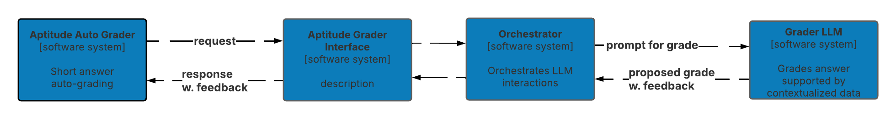

# Architecture Decision Record (ADR)

## ADR-11: Feedback from AI generated grading

### Status
- ACCEPTED

### Context
Providing feedback to candidates is a critical component of the examination process, as it helps them understand their strengths and areas for improvement. The goal is to automate this feedback process while maintaining high quality and relevance.

### Decision
The decision is to implement a feedback generation system integrated with the grading process. This approach ensures that feedback is generated in parallel with the grading, leveraging data and contextual insights from the grading model. We will need to measure the alignment of AI-generated feedback with expert-reviewed feedback using metrics such as correlation coefficients to assess how closely the AI's feedback matches that provided by human reviewers. We will also monitor the time taken to generate and deliver feedback after grading and evaluate whether the integrated approach leads to faster feedback delivery compared to post-processing methods. We will also ensure we stablish criteria for the quality and relevance of feedback generated. Feedback must be accurate, constructive, and aligned with established grading standards. We will adhere to data privacy regulations when processing candidate submissions and generating feedback and ensure that all data used in the feedback process is handled securely and in compliance with applicable laws. see [Privacy Assessment](/ADRs/Privacy-Assessment.md)

### Alternatives Considered

#### 1. Feedback generation system integrated with the grading process.

*Description*:

Integrating the feedback generation into the AI model performing the grading process ensures that the feedback is generated with the right data and context used by the model to produce the final grade. This applies to the LLM considerations for both aptitude test grading and the architectural submission grading. 

*Pros*:
- Contextual Relevance: Generates feedback at the same time as grading, ensuring feedback is based on the most current and accurate context.
- Efficiency: Streamlines the feedback process by combining it with grading, reducing overall processing time.
- Customization: Leverages contextual data to provide referenceable feedback, tailored to each candidate's submission.

*Cons*:
- Complexity: Integrating feedback generation with grading adds complexity to the system.
- Initial Setup: Requires careful configuration to ensure feedback is meaningful and aligned with grading criteria.
- Maintenance: Ongoing updates may be needed to refine feedback mechanisms as grading standards evolve.

#### 2. Post-Processing Feedback Generation

*Description*:

Feedback can be generated following the completion of grading, allowing for a much simpler integration and more focussed approach. Generative AI can still be used as part of this solution, and the prompting for this model would be simpler.

*Pros*:
- Focused Development: Feedback can be developed and refined independently of the grading model.
- Iterative Improvement: Easier to test and adjust feedback generation without affecting the grading process.

*Cons*:
- Context Loss: Feedback may lack contextual relevance if generated separately from grading.
- Increased Latency: Additional processing time needed after grading to generate feedback.
- Integration Challenges: Requires robust mechanisms to tie feedback back to the grading context.

### References
- [ADR-03: Aptitude Test Grader](./ADR-03-Aptitude-Test-Grader.md)
- [ADR-06: Architectural Submission Grader](./ADR-06-Architectural-Submission-Grader.md)

### Date
[Date of the decision]
