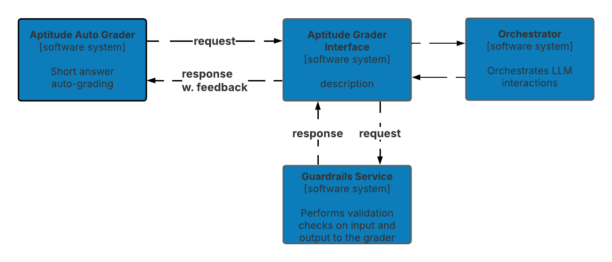

# Architecture Decision Record (ADR)

## ADR 18: Guardrails for Content Appropriateness and Data Security

### Status

- ACCEPTED

### Context

The Generative AI architecture used for grading and providing feedback on exam submissions must maintain high standards of appropriateness and security. It is crucial to ensure that both the input content from exam candidates and the output feedback from the AI are free of inappropriate language or information. Additionally, the system must prevent any leakage of grading criteria or proprietary information from the RAG dataset.

### Decision

The decision is to implement a comprehensive set of guardrails within the GenAI architecture leveraging AI-based guardrails. These guardrails will monitor and filter both the input data and output responses to maintain content appropriateness and protect sensitive information.

### Alternatives Considered

#### **1. Implementation of AI-Based Guardrails (Chosen Option)**

*Description*:

This approach involves embedding AI-based guardrails within the system that use natural language processing (NLP) techniques to detect and filter inappropriate content and potential information leaks. These guardrails function at both the input stage (exam content) and the output stage (feedback).

*Pros*:
- Content Filtering: Effectively screens for inappropriate language or content in both inputs and outputs.
- Data Protection: Prevents leakage of sensitive grading criteria and RAG dataset information.
- Adaptability: AI-based solutions can learn and adapt to new types of inappropriate content or information threats.

*Cons*:
- Complex Implementation: Requires development of sophisticated filtering algorithms and models.
- False Positives/Negatives: Potential for errors in content filtering, which may require ongoing tuning.

#### **2. Manual Review Process**

*Description*:

Involves a human review process where all candidate inputs and AI-generated outputs are manually checked for appropriateness and data security concerns.

*Pros*:
- Accuracy: Human reviewers can provide nuanced judgment in detecting inappropriate content.
- Control: Direct oversight ensures adherence to strict content standards.

*Cons*:
- Scalability Issues: Not feasible for large volumes of data due to resource and time constraints.
- Costly: Requires significant personnel resources, increasing operational costs.

#### **3. Predefined Rule-Based Filtering**

*Description*:

Uses a set of predefined rules and keyword lists to filter out inappropriate content or sensitive information from inputs and outputs.

*Pros*:
- Simplicity: Easier to implement with clear rules and definitions.
- Low Cost: Lower initial cost than AI-based solutions.

### Date
03/06/2025

*Cons*:
- Inflexibility: Hard-coded rules may not adapt well to new or nuanced content issues.
- Limited Coverage: May not effectively identify all types of inappropriate content or information leaks.
