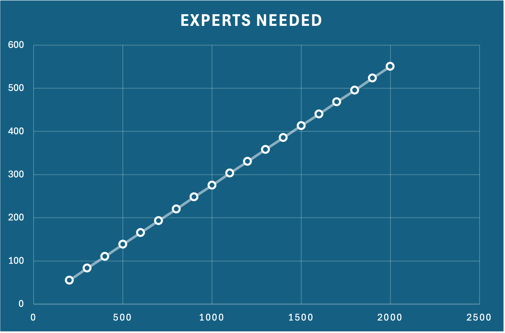
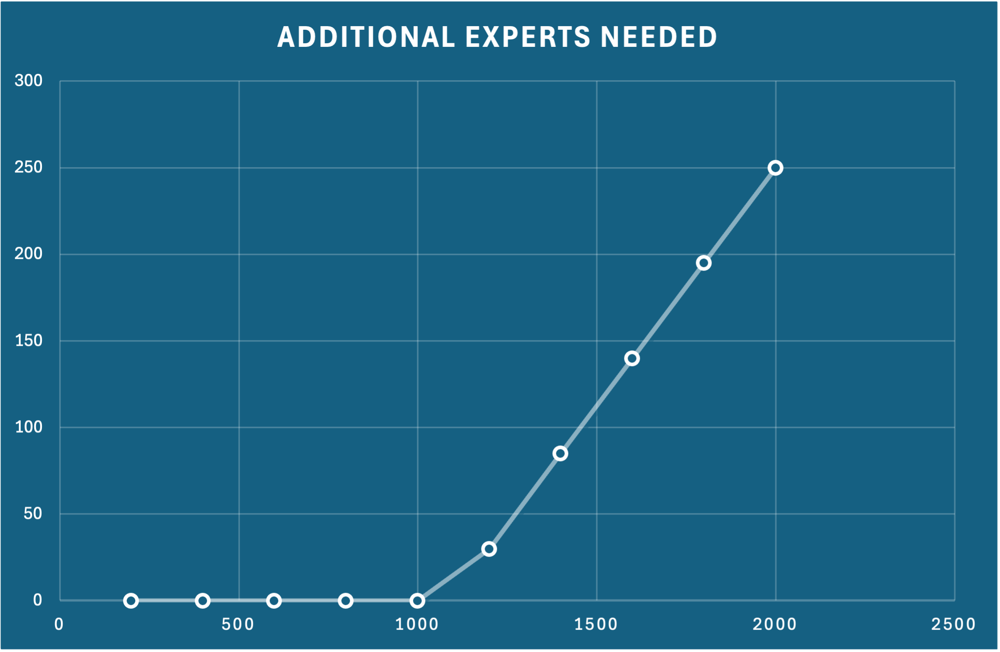

# Architecture Decision Record (ADR) Template

## ADR 19: Operational Effeciency and Profitability

### Status
- DRAFT

### Context
The company is due to scale by up to > 10 times. The income per certification ($800) remains unchanged. We need to ensure that we can still at minimum meet our current SLAs for each test completion. We currently have 300 experts who can perform the assessments.

**Current Situation Analysis**
Current Number of Scoring Experts: 300
Current Weekly Candidates: 200
Current Income from Certification Exams: 160,000
Current Grading Capacity:
Test 1 (Aptitude): 3 hours per candidate
Test 2 (Architecture Submission): 8 hours per candidate
Total grading time for both tests per candidate: (3 + 8 = 11) hours
**Current Weekly Grading Capacity of Experts**
Total Weekly Hours Available per Expert: 40
Total Weekly Hours Available for All Experts: 12,000
Total Candidates That Can Be Graded per Week: approx 1,090

**Projected Growth Scenarios**
We will consider both the 5x and 10x growth scenarios and how they will affect the need for experts and the grading capacity.

**1. 5x Growth Scenario**
Projected Weekly Candidates: 1,000
Total Grading Time Required: 11,000 hours
Current Capacity: 12,000 hours (sufficient to meet 5x growth)
Implication: No immediate need for additional scoring experts under this scenario.

**2. 10x Growth Scenario**
Projected Weekly Candidates: 2,000
Total Grading Time Required: 22,000
Current Capacity: 12,000 hours (**not sufficient to meet 10x growth**)
Deficit: 10,000
Number of Additional Experts Needed for 10x Growth

Additional Experts Needed: 250
Total Experts Required: 550

**Financial Implications**
Weekly Income with 2,000 Candidates: $1,600,000

Net Profit from Certification: 1,100,000

| Weekly Candidates | Total Grading Time Required (hours) | Experts Needed         | Threshold Crossed |
|-------------------|-------------------------------------|------------------------|--------------------|
| 200               | 2,200                               | 55                     |                    |
| 300               | 3,300                               | 83                     |                    |
| 400               | 4,400                               | 110                    |                    |
| 500               | 5,500                               | 138                    |                    |
| 600               | 6,600                               | 165                    |                    |
| 700               | 7,700                               | 193                    |                    |
| 800               | 8,800                               | 220                    |                    |
| 900               | 9,900                               | 248                    |                    |
| 1,000             | 11,000                              | **275**                |                    |
| 1,100             | 12,100                              | **303**                | **Yes**            |
| 1,200             | 13,200                              | 330                    |                    |
| 1,300             | 14,300                              | 358                    |                    |
| 1,400             | 15,400                              | 385                    |                    |
| 1,500             | 16,500                              | 413                    |                    |
| 1,600             | 17,600                              | 440                    |                    |
| 1,700             | 18,700                              | 468                    |                    |
| 1,800             | 19,800                              | 495                    |                    |
| 1,900             | 20,900                              | 523                    |                    |
| 2,000             | 22,000                              | 550                    |                    |

| Weekly Candidates | Additional Experts Needed (Above our current 300) |
|-------------------|---------------------------|
| 200               | 0                         |
| 400               | 0                         |
| 600               | 0                         |
| 800               | 0                         |
| 1,000             | 0                         |
| 1,200             | 30                        |
| 1,400             | 85                        |
| 1,600             | 140                       |
| 1,800             | 195                       |
| 2,000             | 250                       |

**SLA Improvement**
In terms of effeciency we also have an opportunity to reduce the lead time for assessment and feedback to be completed for the candidate. This will enhance satisfaction and help with competition.

### Decision
Use AI to ensure that we do not need to hire additional experts. 

TBC: Determine the cost of AI per Certification (or test) and calculate new potential profit

### Alternatives Considered

Decision on Hiring Additional Experts vs improve effeciency and cost/profitability

Assess the feasibility of hiring 250 additional experts to support the 10x growth scenario.
Consider whether AI or automation can reduce the need for as many experts or increase grading efficiency.

Exploration of Alternative Revenue Streams:

Evaluate opportunities for increasing revenue, such as additional training programs or consulting services for software architects.
Monitoring Market Trends:

Continuously monitor the demand for software architecture certification and adjust hiring strategies as necessary to ensure capacity aligns with projected growth.
Cost-Benefit Analysis of Expert Hiring:

Conduct a thorough analysis of the long-term benefits of hiring additional experts compared to potential revenue increases and market demand.
Implement AI-Assisted Grading:

Consider investing in Generative AI tools to assist in grading processes, potentially reducing the burden on human experts and increasing capacity without proportional hiring.

### References
[Include any relevant references, such as documentation, discussions, or related ADRs, that helped inform the decision.]

### Date
[Date of the decision]
