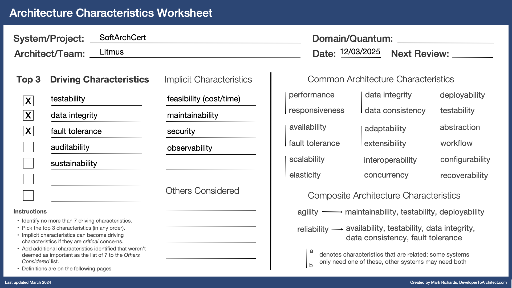

# Architecture Characteristics

Architecture characteristics, often referred to as quality attributes (ilities) or non-functional requirements, define the properties of an architecture to meet the technical and business goals.

## Define needed characteristics

Starting from the business requirements the following important characteristics were deemed as relevant for the SoftArchCert product:

| **Term**             | **Definition**                                                                                                                                                                                                                                                                                                                             |
| -------------------- | ------------------------------------------------------------------------------------------------------------------------------------------------------------------------------------------------------------------------------------------------------------------------------------------------------------------------------------------ |
| **accuracy**         | Accuracy and precision is used to characterize and measure results of an AI process that results in the transformation of data, information, knowledge, or wisdom to a higher-valued form                                                                                                                                                  |
| **availability**     | The amount of uptime of a system; usually measured in 9's (e.g., 99.9%)                                                                                                                                                                                                                                                                    |
| **testability**      | The ease of and completeness of testing                                                                                                                                                                                                                                                                                                    |
| **data integrity**   | The data across the system is correct and there is no data loss in the system                                                                                                                                                                                                                                                              |
| **data consistency** | The data across the system is in sync and consistent across databases and tables                                                                                                                                                                                                                                                           |
| **fault tolerance**  | When fatal errors occur, other parts of the system continue to function                                                                                                                                                                                                                                                                    |
| **cost**             | Taking into account cost implications early and continuously throughout the design, implementation, and ongoing maintainance of the system from a total cost of ownership (TCO) perspective including development, operational, maintenance & support, training, infrastructure, compliance & regulatory, time-to-market, and risks costs. |
| **scalability**      | A function of system capacity and growth over time; as the number of users or requests increase in the system, responsiveness, performance, and error rates remain constant                                                                                                                                                                |
| **auditability**     | Tracking, logging, and providing evidence of operations, decisions, and changes to data over time. This ensures that the system's activities can be reviewed and verified for accuracy, compliance, and security.                                                                                                                          |
| **sustainability**   | ability to maintain long-term operation, adaptability, and efficiency while minimizing negative impacts on the environment, resources, and social aspects                                                                                                                                                                                  |
| **feasibility**      | Taking into account timeframes, budgets, and developer skills when making architectural choices; tight timeframes and budgets make this a driving architectural characteristic                                                                                                                                                             |
| **maintainability**  | The level of effort required to locate and apply changes to the system                                                                                                                                                                                                                                                                     |
| **security**         | The ability of the system to restrict access to sensitive information or functionality                                                                                                                                                                                                                                                     |
| **observability**    | The ability of a system or a service to make available and stream metrics such as overall health, uptime, response times, performance, etc.                                                                                                                                                                                                |

## Choosing the driving characteristics

Key characteristics prioritized:

- **Accuracy**: Accuracy of the certification process is vital for the success of the company, and critical to ensure candidates do not suffer job loss or career damage due to inaccuracy.
- **Reliability**: In addition to the reliability the existing system exhibits.
  - **Availability**: To ensure grades are available for employers to validate certification, that candidates are able to take exams, and that architecture experts are able to manually grade submissions through random sampling or through the appeals process.
  - **Testability**: Robust regression tests are needed for non-deterministic AI systems to ensure quality and accuracy.
  - **Data Integrity**: Data generated by AI systems if not stored correctly with without data loss would be detrimental to the certification process.
  - **Data Consistency**: Data generated by AI systems if not in sync and consistent across databases and tables would be detrimental to the certification process.
  - **Fault Tolerance**: Ensures product stability and partial functional availability in the system in the event of component failure e.g., failure of test 1 functionality does not effect test 2 functionality.
- **Scalability**: Technically there is no challenge in the system meeting current SLAs even with the projected load through expansion, however scalability is a key factor in reducing SLAs in order to maintain a competitive advantage in the marketplace even with expansion, and to add additional certification paths beyond what is offered today.
- **Auditability**: AI systems processes and results can be reviewed and verified for accuracy, compliance, and security.
- **Sustainability**: Workloads, especially AI workloads, use the least amount of energy, cooling, embodied carbon, and carbon emissions possible while serving customer needs.
- **Feasibility**: Cost-effective decisions minimize variance in basic functionality costs, offsetting the uncertainty of AI integration and maintenance, and improving time-to-market to take advantage of opportunities to expand abroad. Continued cost analysis allows us to balancing cost, accuracy, and reducing SLAs over time to maintain market dominance.
- **Maintainability**: Allows us to respond quickly to changes required due to reduction of accuracy in grading, taking advantage of new, more powerful and cost effective models, and new technologies that improve the cost/accurancy/SLA balance.
- **Security**: Essential, as candidate details are stored in the system, along with the entire history of candidate answers to questions, and the examination questions both current and past.
- **Observability**: It is crucial to provide the right level of system observability so errors can be detected early, root cause established and dealt with quickly, and decisions to deploy a temporary increase in manual grading made when needed to keep the grading backlog at manageable levels.

Reduced priorities:

- **Integrity**: This is covered by accuracy, reliability, and auditability,

## Selecting the Top 3 Driving Architecture Characteristics

During the requirements gathering process and the [EventStorming](../Event%20Storming/event-storming.md) session, we identified four main challenges:

- We need to carefully balance cost, accuracy, and SLAs whilst meeting projected scaling targets, potential certification path expansion, and maintain market dominance without having to scale personell linearly with demand.
- GenAI is non-deterministic, so we need a way to continually test, monitor, and calibrate the accuracy of the automatic graders and test generators, along with appropriate human-in-the-loop capabilities.
- We need to be able to satisfactorily explain the process of how the automatic graders determined their score and provided feedback for the purposes of optimisation, and potential external litigation.
- To keep SoftArchCert's continuing competitive advantage we need to ensure the solution can continuously evolve to meet tighter SLAs and customer demands whilst maintaining accuracy and reliability.

These challenges led us to conclude that _Accuracy_, _Reliability_, and _Scalability_ are the top three driving factors for this project.

### Accuracy

- Inaccurate grading can result in a candidate not getting or maintaining a job and can impact a candidate's career.
- Inaccurate or misleading certification exams and case studies can undermine the credibility of the company’s current standing in the marketplace, so accuracy of the certification process is vital for the success of the company.
- Robust regression tests are needed for non-deterministic AI systems to ensure quality due to model degradation, model changes, and changes in source material loaded into the vector database to facilitate the RAG pattern.
- Continuous calibration of the results from AI processes against a small sample of equivalent manual processing ensures accuracy remains high.

### Reliability

- **Availability**: Candidate careers and employment status heavily dependent on certification means the system must be available for candidates to take exams, architecture experts can manually grade/review submissions, and architecture experts can continue to maintain exam material and keep the certification process credible in the marketplace.
- **Testability**: As a recognized leader in certification, accuracy of tests, case studies, and grading inaccurate grading can result in a candidate not getting or maintaining a job and can impact a candidate's career, therefore the system must be easy to test, and those tests provide a sufficient level of coverage and completeness to maintain the high levels of accuracy needed to maintain credibility in the marketplace.
- **Data Integrity**: Data within the databases in the system represent the true exam responses, exam grades and feedback, certification status for all candidates, and that the exam material stored is present and correct and reflects the current benchmark against which examinations are graded.
- **Data Consistency**: Data generated by the AI systems across the various capabilities: test 1, test 2, test generation, accuracy validation remain consistent across the various datastores such that an accurate representation of certification status for all candidates is maintained, and examination material used in the examination process is present and correct across all systems.
- **Fault Tolerance**: Candidate careers and employment status heavily dependent on certification means that even if parts of the system become unavailable candidates can continue to take exams for those tests that are still functional, and that architect experts can continue to maintain the system so at least partially examinations can continue to take place.

### Scalability

- Technically there is no challenge in the system meeting current SLAs even with the projected load through expansion, however scalability is a key factor in reducing SLAs in order to maintain a competitive advantage in the marketplace even with expansion, and to add additional certification paths beyond what is offered today.
- By building scalability into the solution through use of AWS Bedrock to provide AI capabilities, we are leaving the solution open to evolve to support tighter SLAs, and future certification paths beyond what the company offers today, thereby providing a path for the company to grow stronger and remain dominant in the marketplace.

## Selecting the Top 2 Implicit Architecture Characteristics

### Feasability (cost/time)

- Certifiable, Inc. has heard that the use of AI can be somewhat costly and are concerned about significant cost overruns by introducing AI into their certification process. However, while cost is certainly a factor, given that this initiative is a strategic one, they are willing to be somewhat flexible.
- It is important to closely analyse costs and time-to-market in appyling AI functionality to the solution and determine feasibility to justify ROI, and to quickly take advantage of opportunities to expand in the marketplace.
- Balancing cost, accuracy, and SLAs from a technical perspective opens up business opportunities to improve each over time.
- As AI and AI adoption is critical to the continued success of businesses in the future it is important to grow skills in working with, and creating AI systems within the organisation.
- A low cost GenAI model will provide basic inferencing capabilities with the expert software architecture knowledge relevant to queries being supplied by the RAG pattern.
- AWS Bedrock inference batching allows us to spread queries out over time, while still meeting SLAs, and allows us to avail of 50% lower price compared to on-demand inference pricing using AWS Bedrock.
- To future-proof the SoftArchCert system, we aim to ensure the interchangeability of GenAI models so we can continue to leverage advancements in performance, speed, accuracy, and cost to improve SLAs and customer satisfaction.

### Maintainability

- It is important that we are able to respond quickly to changes in order to optimise cost, accuracy, and SLAs over time.
- Changes to examination material may trigger a reduction in accuracy and quick response to this is essential.
- Quickly responding to new AI models, AI technology enhancements and capabilities is important to maintain competitve dominance.
