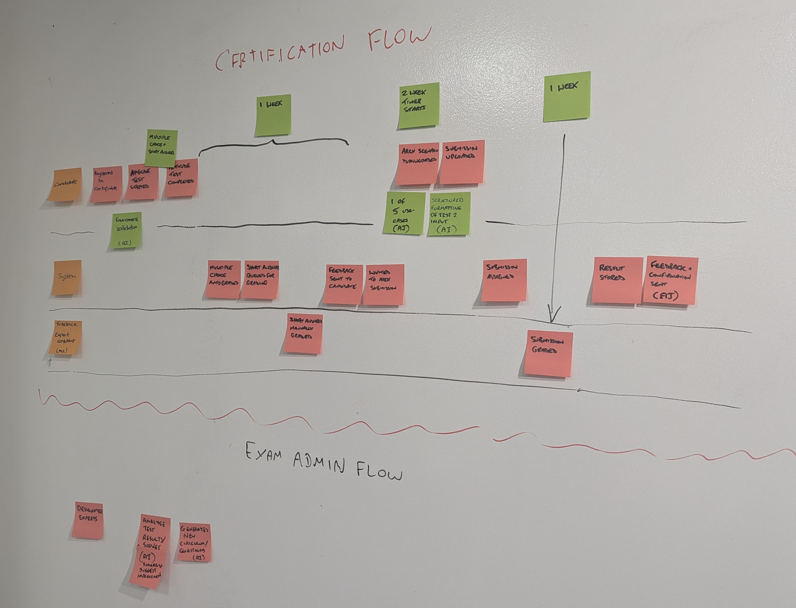
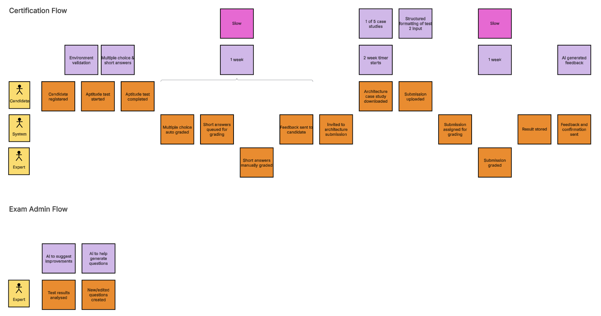

# Event Storming Workshop

## Introduction

In our recent workshop, we used Event Storming to explore and map out various domains within our business processes. 
The session focused on capturing and documenting the flow of events, actors, and interactions between systems. 
This document summarizes our outcomes and serves as a guide to understanding our approach.

## Workshop Goals

- **Discover key domains**: Identify and understand the core business domains and their boundaries.
- **Document workflows**: Capture the flow of domain events, commands, actors, and external systems.
- **Clarify ambiguities**: Document open questions, decisions, problems, and solutions as they arose during the session.

## Workshop Outcomes

We conducted the Event Storming session by placing sticky notes on a wall to map out the workflow in a physical format.

The output was transcribed into digital form as follows: 
