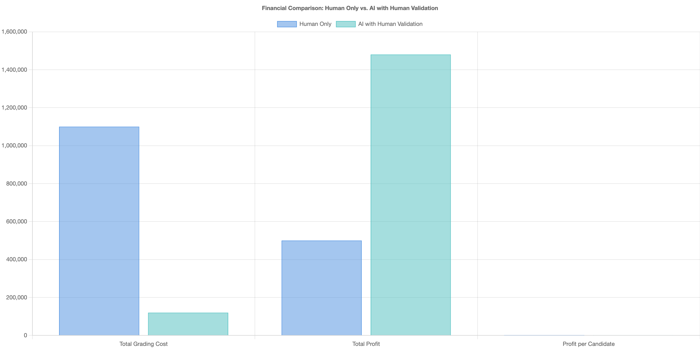

# Operational Analysis: Ensuring Operational Efficiency and Profitability

### Context
Certifiable, Inc. is preparing for significant scaling, with the potential to grow by more than 10 times. The income per certification remains at $800. As we aim to maintain our Service Level Agreements (SLAs) for test completion amidst this growth, it's crucial to assess our current grading capacity expert resources and profit margins.

| Description                          | Human Only                  | AI with Human Validation      |
|--------------------------------------|-----------------------------|-------------------------------|
| Projected Weekly Candidates           | 2,000                       | 2,000                         |
| Total Income ($)                     | 1,600,000                   | 1,600,000                     |
| Total Grading Cost ($)               | 1,100,000                   | 119,558                       |
| Total Profit ($)                     | 500,000                     | 1,480,442                     |
| Total Profit per Candidate ($)       | 250                         | 740.221                       |
| Additional Experts Needed             | 250                         | 0                             |
| **Profit Margin (%)**                | **31.25%**                 | **92.52%**                   |

### SLA Improvement
Enhancing operational efficiency presents an opportunity to reduce lead times for assessments and feedback, thereby increasing candidate satisfaction and improving competitive positioning.

### AI Financial Options

See the /Research/llm-cost-calculations.xlsx for costing with different models. This is based on using the Claude 3.5 Sonnet model and where we Human random sample 10% of all tests. Over time as we scale and our confidence in the AI increases we can reduce this verfication %.
Cost and accurate of model will also continue to improve and we will evaluate frequently. 

## SLA Impact:
Overtime as the AI model becomes accurate and the need for human verification reduces we could reduce the SLA for candidates to a shorter timeframe than today.
This will also help employers awaiting certification and improve our overall experience and keep us as the industry leader.