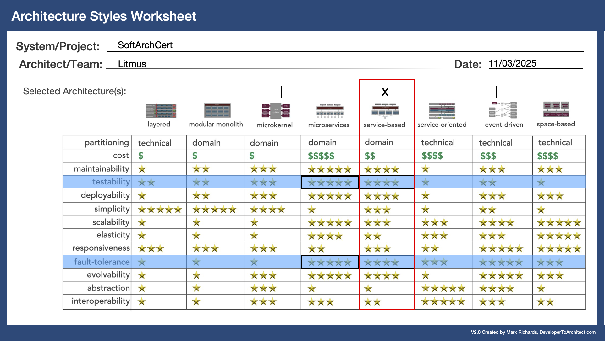

# Litmus | O'Reilly Architectural Kata Winter 2025: AI-Enabled Architecture

Our approach to the O'Reilly Winter Architectural Kata 2025

- [Team](#team)
- [Introduction](#introduction)
- [Key Objectives](#key-objectives)
  - [Architectural Decision Records (ADRs)](#architectural-decision-records-adrs)
- [Product Implementation Decisions](#product-implementation-decisions)
- [Best Practices](#best-practices)
- [Event Storming](#event-storming)
- [Requirements](#requirements)
  - [Functional Requirements](#functional-requirements)
  - [Non-Functional Requirements](#non-functional-requirements)
- [Architecture Characteristics](#architecture-characteristics)
- [Architecture Style](#architecture-style)
- [Architecture](#architecture)
  - [System Context Diagram (C1)](#system-context-diagram-c1)
  - [Container Diagram (C2)](#container-diagram-c2)
    - [Aptitude Test Grader Proposed Architecture](#aptitude-test-grader-proposed-architecture)
    - [Architecture Submission Grader Proposed Architecture](#architecture-submission-grader-proposed-architecture)
- [Known Limitations](#known-limitations)
- [Usage of GenAI](#usage-of-genai)
- [Research](#research)
- [Appendix](#appendix)
  - [Deliverables for the Architecture Kata](#deliverables-for-the-architecture-kata)
  - [Judge's Criteria for Evaluation](#judges-criteria-for-evaluation)
- [Glossary](#glossary)
- [Version History](#version-history)

## Team

- Karl Kyck, [Linkedin](https://www.linkedin.com/in/karlkyck/)
- Ivan Houston, [Linkedin](https://www.linkedin.com/in/ivan-houston-019ab1169/)
- Craig McCarter, [Linkedin](https://www.linkedin.com/in/craig-mccarter-28160557/)
- Darren Muldoon, [Linkedin](https://www.linkedin.com/in/darrenmuldoon/)
- Susan O'Brien, [Linkedin](https://www.linkedin.com/in/susan-o-brien-83154333/)

## Introduction

Certifiable, Inc. is an accredited leader in the software architecture certification market, primarily based in the United States. As the owner of a substantial market share, the company’s flagship system, SoftArchCert, provides accredited certification for qualified software architects.

### Current Market Position

- Established as a trusted authority in software architecture certification.
- Significant market share in the United States.

### Challenge

- Recent global acceptance leading to increased demand from Europe, the U.K., and Asia.
- Anticipated surge in certification requests (5-10 times current volume).
- Concerns over existing manual processes meeting the heightened demand.

### Response

- Exploring the integration of Generative AI to enhance systems and streamline operations.
- **Goals:** Effectively handle the influx of certification applications.

### Key Objectives

----------------
**AI Enhanced System - TLDR:**
- AI grading for the Aptitude Test
- AI RAG Ensemble based grading for Architecture Submission
- AI Architecture Question generation
- AI Generated Feedback

*Rejected*
- AI Agent to monitor candidate cheating (Rejected)
- LLM Caching in the system (Rejected)
  
The following ADRs provide the detail around these decisions and the safeguards and other consideration.

----------------
### Architectural Decision Records (ADRs)

- **Automate Grading and Review Processes**: Explore ways in which Generative AI can automate the grading and review of 
software architecture submissions, reducing the burden on expert architects and accelerating response times for
certification.
   - [ADR-03: Aptitude Test Grader](/ADRs/ADR-03-Aptitude-Test-Grader.md)
   - [ADR-04: Handling Low Confidence Scores in AI-Enhanced Grading](/ADRs/ADR-04-Handling-Low-Confidence-Scores-in-AI-Enhanced-Grading.md)
   - [ADR-05: Structured Formatting of Exam Inputs](/ADRs/ADR-05-Structured-Formatting-of-Exam-Inputs.md)
   - [ADR-06: Architectural Submission Grader](/ADRs/ADR-06-Architectural-Submission-Grader.md)
   - [ADR-16: Processing strategy for exam grading](/ADRs/ADR-16-Processing-strategy-for-exam-grading.md)

- **Identify AI Opportunities**: Assess the current SoftArchCert system to identify specific areas where Generative AI 
can be applied to improve efficiency, scalability, and accuracy in handling certification requests.
   - [ADR-07: Using AI to generate Architecture questions for the exam](/ADRs/ADR-07-Using-AI-to-generate-Architecture-questions-for-the-exam.md)

- **Redesign System Architecture**: Develop a comprehensive plan for redesigning the SoftArchCert system architecture to
incorporate AI capabilities, ensuring the architecture can support the anticipated growth in certification volume.
   - [ADR-08: Data Pipeline ETL](/ADRs/ADR-08-Data-Pipeline-ETL.md)
   - [ADR-09: Approach for RAG implementation](/ADRs/ADR-09-Approach-for-RAG-implementation.md)

- **Enhance User Experience**: Identify improvements in user experience for both applicants and certifiers through the 
integration of AI, ensuring that the certification process remains intuitive and efficient.
    - [ADR-10: AI agent to monitor candidates for cheating](/ADRs/ADR-10-AI-Agent-to-monitor-candidates-for-cheating.md)
    - [ADR-11: Feedback from AI generated grading](/ADRs/ADR-11-Feedback-from-AI-generated-grading.md)
    - [ADR 12: Utilizing LLM Caching in the System](/ADRs/ADR-12-Utilizing-LLM-Caching-in-the-System.md)

- **Ensure Compliance and Quality**: Establish mechanisms to maintain the integrity and quality of certification 
standards, ensuring that the integration of AI does not compromise the rigorous evaluation process that Certifiable, 
Inc. is known for.
    - [ADR-13 Data Provisioning for Analytics and AI Model Development](/ADRs/ADR-13-Data-Provisioning-for-Analytics-and-AI-Model-Development.md)
    - [ADR-14: Hosting strategy](/ADRs/ADR-14-Hosting-strategy.md)
    - [ADR-15: Grader Output Validation](/ADRs/ADR-15-Grader-Output-Validation.md)
    - [ADR-17: Validating AI Generated Answers Against Historical Data](/ADRs/ADR-17-Validating-AI-Generated-Answers-Against-Historical-Data.md)

## Product Implementation Decisions

- **Maintain our Reputation**: Identify areas of potential concern to our security posture and reputation as the company scales and introduces AI use.
    - [Security Assessment](/ProductImplementationDecisions/Security-Assessment.md)
    - [Privacy Assessment](/ProductImplementationDecisions/Privacy-Assessment.md)
    - [Environmental Impact](/ProductImplementationDecisions/Environmental-Impact.md)
    - [Authorization and Authentication](/ProductImplementationDecisions/User-Authentication-and-Authorization.md)

- **Improve operational effeciency and profitability**: Scaling in a manner that allows us to remain profitable, efficient and able to meet our SLAs
    - [Operational Effeciency and Profitability](/ProductImplementationDecisions/Operational-Analysis.md)

## Best Practices

We will adhere to best practices in AI Architecture Design ensuring we include Guardrails and Evals where appropriate:

- **Modular Design:**

Structure the system into distinct, independent modules that can be developed, tested, and maintained separately.
This will enhance flexibility, allows for easier updates, and improve collaboration. For example, separate modules for data preprocessing, model training, and model inference.

 - **Scalability:**

Design a system that can handle increased loads and expanded datasets without significant rewrites.
This will facilitate the growth of the system in response to higher data volumes or more users.

- **Data Management:**

Implement a robust data pipeline for data ingestion, preprocessing, and storage. Ensure data quality and governance practices are in place.
Streamlineing data access and ensuring that high-quality data is used for model training, improving model accuracy.

- **Model Lifecycle Management:**

Adopting practices for versioning, testing, and deploying AI models (e.g., CI/CD for models).
This will ensure reproducibility, facilitating rollback to previous versions, and maintaining performance over time. Tools like MLflow or Kubeflow can be used for model lifecycle management.

- **Monitoring and Evaluation:**

Setting up monitoring systems to track model performance, data drift, and anomalies after deployment.
This will help to maintain the performance of models over time and allows for timely interventions when models begin to degrade.

- **Explainability and Transparency:**

Designing systems to provide insights into how AI models make decisions (e.g., using LIME, SHAP).
This will build trust among stakeholders and aids in compliance with regulations such as GDPR, which requires explainability in AI systems.

- **Ethical Considerations:**

Incorporating ethical guidelines into the design process to address biases, fairness, and accountability in AI.
This will foster responsible AI development and use, reducing the risk of harm to individuals or groups.

- **Feedback Loops:**

Design systems to incorporate feedback from users or performance metrics to continuously improve models.
This will facilitate ongoing refinement of models and alignment with user needs.
   
## Event Storming

We used [Event Storming](/Event%20Storming/event-storming.md) to explore and map out various domains within our business
processes. The session focused on capturing and documenting the flow of events, actors, and interactions between
systems. This document summarizes our outcomes and serves as a guide to understanding our approach.

## Requirements

### Functional Requirements

1. **Integration of Generative AI**
   - Identify opportunities to incorporate Generative AI into the SoftArchCert system to enhance certification processes.

2. **Automated Grading**
   - Implement AI-assisted grading for short answer questions in the aptitude test and architecture submissions to reduce the manual workload on expert software architects.

3. **Certification Process Enhancement**
   - Automate parts of the certification process to improve efficiency, such as notification systems for candidates based on their test results.

4. **User Interface Improvements**
   - Develop an intuitive user interface for candidates, HR representatives, and expert software architects to interact with the certification system.

5. **Scalability**
   - The system must be designed to handle a significant increase in certification requests (5-10X) due to global expansion.

6. **Dynamic Case Study Management**
   - Implement a mechanism to dynamically manage and update case studies and questions to prevent information leaks and maintain current relevance in the certification process.

7. **Data Retrieval**
   - Enable effective information retrieval processes that provide relevant data and context to the Generative AI model when grading submissions.

8. **Feedback Mechanism**
   - Provide candidates with detailed feedback on their performance, including AI-generated insights alongside expert evaluations.

### Non-Functional Requirements

1. **Accuracy and Reliability**
   - Ensure the accuracy of grading and certification processes, as incorrect assessments can significantly impact candidates' careers.

2. **Compliance and Standards**
   - The system must comply with relevant legal and accreditation standards, including those set by the Software Architecture Licensing Board (SALB).

3. **Performance and Efficiency**
   - Maintain a guaranteed turnaround time for grading (1 week for both tests) while accommodating increased demand without compromising service levels.

4. **Cost Management**
   - Analyze the cost implications of integrating AI into the certification process and ensure that it remains within budgetary constraints.

5. **Security and Data Privacy**
   - Implement data security measures to protect sensitive candidate information and certification data.

6. **Monitoring and Evaluation**
   - Establish metrics and monitoring tools to evaluate the performance and effectiveness of the AI-enhanced grading system.

7. **Documentation and Compliance**
   - Ensure proper documentation of AI implementation processes for compliance and auditing purposes.

8. **User Trust and Ethics**
   - Address potential ethical concerns about AI use in grading, ensuring that the responses generated are appropriate and reliable.

## Architecture Characteristics
We chose the following as our top 3 [architectural characteristics](./Architecture%20Characteristics/architecture-characteristics.md):

- accuracy
- reliability
- scalability

## Architecture Style

According to the TOP 3 driving characteristics and TOP 2 implicit characteristics*:

- cost (feasability)*
- maintainability*
- testability (reliability)
- simplicity (feasability)*
- scalability
- fault-tolerance (reliability)

a service-based architecture was selected to leverage the optimal balance between the driving architecture characteristics: testability, fault-tolerance, scalability; and implicit architectural characteristics: feasibility (cost/time) and maintainability.

## Architecture

By utilizing the [C4](https://c4model.com/) approach to visualize software architecture, we were able to depict 
the dependencies among different components of our application while highlighting their relationships. We 
will primarily concentrate on the C2 views to present an overarching overview, followed by a deeper exploration 
of the core components in the C3 view later in the process.

### System context diagram (C1)

### Container diagram (C2)

Container diagrams for new architectural components

#### Aptitude Test Grader Proposed Architecture

#### Architecture Submission Grader Proposed Architecture

## Known Limitations

The current architecture has the following limitations:
  - In the future we could implement an AI agent that utilizes machine learning algorithms to monitor candidates during assessments, analyse behavioral patterns, and identify anomalies that may indicate cheating but we decided against this for MVP as outlined in [ADR-10 AI Agent to monitor candidates for cheating](/ADRs/ADR-10-AI-Agent-to-monitor-candidates-for-cheating.md)

## Usage of GenAI

This repository contains content that was partially generated using Generative AI technologies. We have utilized these tools to assist in the creation and enhancement of certain aspects of the project. However, please note that all AI-generated content has been carefully reviewed and edited by our team to ensure accuracy, quality, and relevance before being included in the project.

## Research

Research was undertaken to understand what mature AI capabilites, architecture patterns, practices, and approaches are currently available in the industry:

- [Prompt engineering and RAG retrieval simulation](./Research/prompt-research.md)
- [Experimental application demonstrating RAG vector database loading, retrieval, LLM context loading, and prompting](./Research/rag-pattern-experimental-app.md)
- [LLM cost analysis for various LLM models and scenarios](./Research/llm-cost-calculations.md)

## Appendix:

### Deliverables for the Architecture Kata

- **Overview Narrative**
  - A short narrative describing how the team used AI in the certification system.
- **Diagrams**
  - Comprehensive and targeted views of each use of AI in the system.
- **Architectural Decision Records (ADRs)**
  - Document AI implementation decisions, including trade-off analysis.
- **Implementation Details**
  - Provide pertinent implementation details for the AI components.
- **Presentation Video (for semi-final teams)**
  - A five-minute video describing the team’s approach to integrating AI into the certification process.

### Judge's Criteria for Evaluation

- **Innovative Use of Generative AI**
  - Assess the novelty and creativity of AI applications in the solution.

- **Suitability of the Solution**
  - Ensure that the solution addresses the stated constraints and requirements.

- **Detail and Clarity**
  - Provide appropriate levels of detail in documentation and diagrams.

- **Use of AI Architecture Patterns**
  - Adhere to best practices in AI architecture design.

- **Avoidance of Anti-Patterns**
  - Ensure that the design does not incorporate known anti-patterns.

- **Compatibility with Existing Architecture**
  - Validate that the architectural characteristics of the AI enhancements align with the current system architecture.

- **Validation and Verification**
  - Establish processes for validating and verifying AI-generated results to ensure accuracy.
