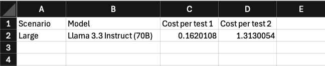

## LLM Cost Calculations

As part of the feasibility analysis for this project we decided to conduct an analysis into LLM costings for AWS Bedrock to determine estimated average Cost Per Test 1 Grading, and Cost Per Test 2 Grading:

- The costs of batch processing over on-demand processing.
- The costs for a variety of different models that support batch processing.
- Costings across a variety of possible input and output token sizes for the different testing types, scenarios, and LLM personas (ensemble)
- Costings for additional tooling such as:
  - Structured Data Retrieval (SQL Generation)
  - Reranking which is designed to improve the relevance and accuracy of responses in RAG applications.
- Costings for guardrails:
  - Content filters (text content).
  - Denied topics.
  - Contextual grounding check.
  - Sensitive information filters (PII).
  - Sensitive information filters (regular expression).
  - Word filters.

We delevoped an [LLM costings analysis excel file](./llm-cost-calculations.xlsx) to run these calculations for us with the facility to input various scenarios and model costs that can be selected with drop down menus:



### Scenarios

Where the scenarios are based on assumptions:

| Scenario | Test 1 tokens | Test 1 num questions | Test 2 tokens | Test 2 num personas |
| -------- | ------------- | -------------------- | ------------- | ------------------- |
| Small    | 5000          | 10                   | 50000         | 5                   |
| Medium   | 10000         | 20                   | 100000        | 10                  |
| Large    | 15000         | 30                   | 150000        | 15                  |

Where:

- **Test 1 tokens**: are the estimated average number of input tokens per prompt per one short question.
- **Test 1 num questions**: are the average number of short questions in Test 1.
- **Test 2 tokens**: are the estimated average number of input token per prompt per LLM persona.
- **Test 2 num personas**: are the estimated number of personas as part of the AI ensemble being used to grade questions across a variety of subject matter expertise.

### Models

For a variety of models where the price per 1000 input tokens and per 1000 output tokens are used in the calculation:

| Model                    | PP 1000 input tokens | PP 1000 output tokens |
| ------------------------ | -------------------- | --------------------- |
| Llama 3.3 Instruct (70B) | 0.00036              | 0.00036               |
| Claude 3.5 Sonnet        | 0.0015               | 0.0075                |

### Tools

Factoring in the usage of AI tooling as part of each query:

| Knowledge Bases per query | Guardrails per 1000 text units |
| ------------------------- | ------------------------------ |
| 0.003                     | 0.5                            |

### Formula

#### Cost Per Test 1 Grading

```
(Cost per tokens to grade one short question X average num of questions) + cost per one Knowledge Bases query + cost of one Guardrails query
```

#### Cost Per Test 2 Grading

```
(Cost per tokens to grade one architecture submission per persona X num of personas) + (cost per one Knowledge Bases query X number of personas) + (cost of one Guardrails query X number of personas)
```
