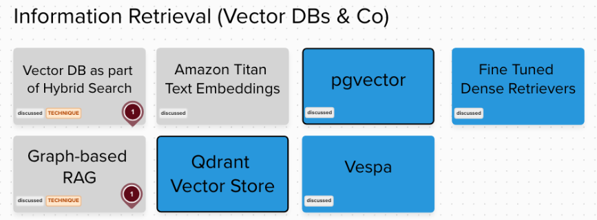

## Rag Pattern Experimental Application

We wanted to explore further the RAG pattern and specifically generate embeddings and load them a database with information and subsequent retrieval of information to supply additional context to our prompts.

One of our engineers put together an experiment in using an LLM to ‘vibe code’ a single page HTML app, that:

- Uses pgLite & pgVector to store a zip of documents.
- Have a search function to query the database and return the relevant document.
- Load the document into the target LLM to provide context for further prompting.

